<div align="center">
<picture>
  <source media="(prefers-color-scheme: dark)" srcset=".github/brand/banner-night.svg">
  
</picture>
<br><br>
<a href="#about"><picture><source media="(prefers-color-scheme: dark)" srcset=".github/brand/tab-about-night.svg"></picture></a>
<a href="#components"><picture><source media="(prefers-color-scheme: dark)" srcset=".github/brand/tab-components-night.svg"></picture></a>
<a href="#quickstart"><picture><source media="(prefers-color-scheme: dark)" srcset=".github/brand/tab-quickstart-night.svg"></picture></a>
</div>

<p>
<a name="about"></a>
<picture><source media="(prefers-color-scheme: dark)" srcset=".github/brand/section-about-night.svg"></picture>
</p>

NF-ToolBox is the license backbone for the NF Software tool line: a Go API server that issues and verifies licenses, a CLI (`nf-toolbox`) end users install tools through, and a shared Go package (`pkg/license`) any NF tool embeds to check entitlement at startup.

<p>
<a name="components"></a>
<picture><source media="(prefers-color-scheme: dark)" srcset=".github/brand/section-components-night.svg"></picture>
</p>

| Component | Path | Purpose |
|-----------|------|---------|
| **Server** | `cmd/server/` | License API — auth, activation, renewal, Stripe webhooks |
| **Toolbox CLI** | `cmd/toolbox/` | `login · list · install · update · sync · devices · status` |
| **License package** | `pkg/license/` | Fingerprinting, signing, verification — embed in any NF tool |
| **Keygen** | `cmd/keygen/` | Generates signing keys for the server |

<p>
<a name="quickstart"></a>
<picture><source media="(prefers-color-scheme: dark)" srcset=".github/brand/section-quickstart-night.svg"></picture>
</p>

```sh
createdb license_db
psql -d license_db < migrations/001_initial.sql

go run cmd/keygen/main.go        # generate keys, add to .env
cp .env.example .env

make run                          # start the server
go build -o bin/nf-toolbox cmd/toolbox/main.go
```

```sh
nf-toolbox login
nf-toolbox install <tool>
nf-toolbox sync        # renew license after purchase
nf-toolbox status
```

<details>
<summary><b>🔌 API Endpoints</b></summary>
<br>

| Endpoint | Auth | Purpose |
|----------|------|---------|
| `POST /api/v1/auth/register` · `/login` | — | Account creation & login |
| `POST /api/v1/activate` · `/renew` | Bearer | License activation / renewal |
| `GET /api/v1/license` · `/devices` · `/tools` · `/me` | Bearer | Read current state |
| `DELETE /api/v1/devices/{id}` | Bearer | Deactivate a device |
| `POST /webhooks/stripe` | Stripe sig | Payment events |

</details>

<details>
<summary><b>🧩 Integrating a tool</b></summary>
<br>

```go
import "github.com/nf-software/nf-toolbox/pkg/license"

func main() {
    if err := license.CheckEntitlement("your-tool-name"); err != nil {
        fmt.Fprintln(os.Stderr, "Run: nf-toolbox login && nf-toolbox install your-tool")
        os.Exit(1)
    }
}
```

</details>

<div align="center">

Made with ♥ by [NoamFav](https://github.com/NoamFav) · Proprietary — NF Software

</div>

<br>

<a href="https://nf-software.com">
<picture>
  <source media="(prefers-color-scheme: dark)" srcset=".github/brand/footer-night.svg">
  
</picture>
</a>
